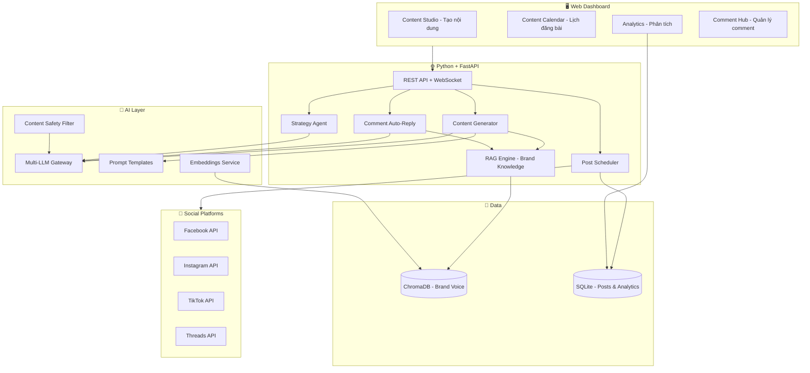

# 🧠 SocialBrain AI — AI Social Media Manager

## Mục tiêu dự án

Xây dựng nền tảng **quản lý Social Media bằng AI** giúp influencer, shop online, và SME:
- **Tạo nội dung** bài đăng tự động (caption, hashtag, script video)
- **Lên lịch đăng bài** đa nền tảng (Facebook, Instagram, Threads, TikTok)
- **Phân tích engagement** và gợi ý cải thiện
- **Trả lời comment/DM** tự động bằng AI
- **Lên chiến lược content** dài hạn với AI Agent

**Nền tảng hỗ trợ:** Facebook · Instagram · Threads · TikTok

**Monetize:** Freemium SaaS ($15–50/tháng)

---

## Kiến trúc hệ thống



---

## User Review Required

> [!IMPORTANT]
> **Social Media API:** Trong giai đoạn đầu, ta sẽ **mock (giả lập)** các Social API để tập trung vào phần AI. Khi dự án hoàn thiện mới tích hợp API thật (Facebook Graph API, TikTok API cần đăng ký developer account). Bạn OK với cách tiếp cận này?

> [!IMPORTANT]
> **LLM Provider:** Mình gợi ý bắt đầu với **Google Gemini** (có free tier 15 request/phút, đủ để học). Sau đó mở rộng thêm OpenAI, Ollama. Mình sẽ hướng dẫn bạn tạo API key ở Phase 1.

## Open Questions

> [!IMPORTANT]
> 1. **Tên repo GitHub:** Gợi ý `socialbrain-ai` — bạn thấy OK không hay muốn tên khác?
> 2. **Ngôn ngữ giao diện:** Tiếng Việt hay tiếng Anh (tiếng Anh sẽ dễ bán quốc tế hơn)?

---

## Phase 0: Cài đặt môi trường & Học Git cơ bản

**🗺️ Roadmap:** *Prerequisites — Git, GitHub, Python setup*

### Việc cần làm

#### Bước 1: Cài Git
- Tải & cài Git for Windows
- Cấu hình `git config --global user.name` và `user.email`
- Tạo SSH key để kết nối GitHub (không cần nhập mật khẩu mỗi lần push)

#### Bước 2: Tạo repository trên GitHub
- Tạo repo `socialbrain-ai` trên GitHub (public)
- Clone về máy: `git clone git@github.com:<username>/socialbrain-ai.git`

#### Bước 3: Khởi tạo dự án Python
```
socialbrain-ai/
├── .gitignore              # Loại trừ: .env, __pycache__, venv/, chroma_data/
├── .env.example            # Template API keys (KHÔNG chứa key thật)
├── README.md               # Giới thiệu dự án
├── requirements.txt        # Dependencies
├── backend/
│   ├── __init__.py
│   ├── main.py             # FastAPI entry point
│   ├── config.py           # Đọc biến môi trường
│   ├── routers/            # API endpoints
│   ├── services/           # Business logic
│   ├── models/             # Pydantic schemas
│   └── utils/              # Helpers
├── frontend/
│   ├── index.html          # Main page
│   ├── css/
│   │   └── style.css       # Dark theme, glassmorphism
│   └── js/
│       └── app.js          # Frontend logic
├── data/                   # Sample data
├── tests/                  # Unit tests
└── docs/
    └── git-cheatsheet.md   # Tài liệu Git nhanh
```

#### Bước 4: Học Git qua thực hành
```bash
git add .                           # Stage tất cả file
git commit -m "Phase 0: Project setup"  # Commit
git push origin main                # Push lên GitHub
```

**📚 Git concepts học được:** init, clone, add, commit, push, .gitignore, remote

---

## Phase 1: LLM Gateway — Kết nối AI

**🗺️ Roadmap:** *LLM Fundamentals — Tokens, Context Windows, Multi-provider API*

### Mục tiêu
Xây dựng lớp kết nối thống nhất với nhiều LLM provider, hiểu rõ cách LLM hoạt động.

### Tính năng cụ thể cho SocialBrain
- Chat đơn giản với AI qua web UI
- Chọn provider (Gemini / OpenAI / Ollama)
- Hiển thị **token count** và **chi phí ước tính** cho mỗi request
- **Streaming response** (chữ hiện ra từng từ như ChatGPT)

### Files

#### [NEW] backend/services/llm_gateway.py
- Abstract class `LLMProvider` với method: `generate()`, `stream()`, `count_tokens()`
- `GeminiProvider` — gọi Google Gemini API
- `OpenAIProvider` — gọi OpenAI API (implement sau)
- `OllamaProvider` — gọi Ollama local (implement Phase 6)
- Token tracking cho mỗi request

#### [NEW] backend/routers/chat.py
- `POST /api/chat` — Chat thường
- `GET /api/chat/stream` — SSE streaming
- `GET /api/providers` — Liệt kê provider khả dụng

#### [NEW] frontend/ — Chat UI cơ bản
- Giao diện chat dark theme
- Dropdown chọn LLM provider
- Hiển thị token usage

### Hướng dẫn tạo Gemini API Key
1. Vào https://aistudio.google.com/apikey
2. Đăng nhập Google → Create API Key
3. Copy key vào file `.env`: `GEMINI_API_KEY=your_key_here`

**📚 Git concepts:** branch (`git checkout -b feature/llm-gateway`), merge, pull request

---

## Phase 2: Content Generator — Tạo nội dung bằng AI

**🗺️ Roadmap:** *Prompt Engineering — Zero-shot, Few-shot, CoT, Structured Output*

### Mục tiêu
Xây dựng engine tạo nội dung social media chất lượng cao, học các kỹ thuật prompt engineering.

### Tính năng cụ thể
- **Tạo caption** cho Facebook/Instagram/Threads (tone phù hợp từng nền tảng)
- **Tạo script TikTok** (hook → body → CTA)
- **Gợi ý hashtag** trending + niche-specific
- **Tạo content theo lô** (batch) — 1 chủ đề → 7 bài cho cả tuần
- **Prompt Playground** — thử nghiệm & so sánh prompt

### Files

#### [NEW] backend/services/content_generator.py
- Prompt templates cho từng nền tảng (FB, IG, TikTok, Threads)
- Strategies: zero-shot (nhanh), few-shot (chất lượng), CoT (phân tích sâu)
- **Structured output:** Buộc AI trả JSON chuẩn:
  ```json
  {
    "caption": "...",
    "hashtags": ["#ai", "#marketing"],
    "best_posting_time": "19:00",
    "content_type": "carousel",
    "hook": "...",
    "cta": "..."
  }
  ```
- Batch generation: tạo content plan cả tuần

#### [NEW] backend/prompts/
- `facebook.jinja2` — Template cho bài Facebook (dài, storytelling)
- `instagram.jinja2` — Template cho IG (visual-first, emoji-rich)
- `tiktok.jinja2` — Template cho TikTok script (hook 3 giây)
- `threads.jinja2` — Template cho Threads (ngắn, conversational)

#### [NEW] backend/routers/content.py
- `POST /api/content/generate` — Tạo nội dung cho 1 bài
- `POST /api/content/batch` — Tạo content plan cả tuần
- `POST /api/content/hashtags` — Gợi ý hashtag
- `GET /api/content/templates` — Liệt kê templates

#### [MODIFY] frontend/ — Content Studio UI
- Form nhập: chủ đề, nền tảng, tone, ngôn ngữ
- Preview bài đăng giống giao diện thật (mock FB post, IG post)
- So sánh output giữa các prompt strategies
- Batch generator: nhập 1 chủ đề → hiển thị 7 bài

**📚 Git concepts:** commit message conventions, git diff, git log

---

## Phase 3: Brand Knowledge Base — RAG cho thương hiệu

**🗺️ Roadmap:** *Embeddings, Vector DB, RAG — Retrieval-Augmented Generation*

### Mục tiêu
Cho phép người dùng upload tài liệu về brand (brand guidelines, FAQ, sản phẩm) → AI tạo nội dung đúng tone và thông tin chính xác. Đây là **killer feature** — biến AI từ "generic" thành "hiểu brand của bạn".

### Tính năng cụ thể
- **Upload brand documents:** PDF brand guidelines, danh sách sản phẩm, FAQ, bài mẫu
- **Brand Voice Learning:** AI học cách viết giống style của brand
- **Product-aware content:** Tạo bài quảng cáo chính xác về sản phẩm
- **Tìm kiếm ngữ nghĩa** trong knowledge base

### Files

#### [NEW] backend/services/embeddings.py
- Tạo embeddings (Gemini embedding hoặc OpenAI text-embedding)
- Text chunking: recursive character splitting (tối ưu cho tài liệu dài)

#### [NEW] backend/services/vector_store.py
- ChromaDB integration: create collection, add, search, delete
- Metadata filtering (theo loại tài liệu, ngày upload)

#### [NEW] backend/services/document_processor.py
- Đọc file: `.txt`, `.pdf`, `.md`, `.docx`
- Trích xuất text, split thành chunks, lưu vào ChromaDB

#### [NEW] backend/services/rag_engine.py
- RAG pipeline: Query → Retrieve relevant chunks → Inject vào prompt → Generate
- Citation: mỗi câu trả lời kèm nguồn trích dẫn
- Brand voice extraction: phân tích bài mẫu → tạo style guide tự động

#### [NEW] backend/routers/knowledge.py
- `POST /api/knowledge/upload` — Upload tài liệu
- `GET /api/knowledge/documents` — Liệt kê tài liệu
- `POST /api/knowledge/search` — Tìm kiếm ngữ nghĩa
- `DELETE /api/knowledge/{id}` — Xóa tài liệu

#### [MODIFY] backend/services/content_generator.py
- Tích hợp RAG: khi tạo content, tự động truy xuất brand knowledge

#### [MODIFY] frontend/ — Knowledge Base UI
- Drag & drop upload documents
- Hiển thị danh sách tài liệu + trạng thái xử lý
- Search bar tìm kiếm trong knowledge base

**📚 Git concepts:** `.gitignore` nâng cao (ignore data files), git stash

---

## Phase 4: Content Calendar — Lên lịch đăng bài

**🗺️ Roadmap:** *Backend Engineering — Database, Scheduling, CRUD APIs*

### Mục tiêu
Xây dựng hệ thống lên lịch và quản lý bài đăng — chức năng core của social media manager.

### Tính năng cụ thể
- **Content Calendar** dạng lịch tháng/tuần (drag & drop)
- **Lên lịch đăng bài** cho từng nền tảng
- **AI gợi ý thời gian đăng tối ưu** (dựa trên phân tích)
- **Trạng thái bài:** Draft → Scheduled → Published → Archived
- **Mock Social API:** Giả lập việc đăng bài (Phase sau mới kết nối thật)

### Files

#### [NEW] backend/services/scheduler.py
- Lên lịch bài đăng (SQLite + APScheduler)
- Queue management: retry, timeout
- Mock social publisher (giả lập đăng bài thành công)

#### [NEW] backend/services/database.py
- SQLite setup với SQLAlchemy
- Tables: `posts`, `schedules`, `platforms`, `analytics`

#### [NEW] backend/routers/calendar.py
- `GET /api/calendar` — Lấy lịch đăng bài theo tháng/tuần
- `POST /api/posts` — Tạo bài đăng mới
- `PUT /api/posts/{id}/schedule` — Lên lịch
- `DELETE /api/posts/{id}` — Xóa bài

#### [MODIFY] frontend/ — Calendar UI
- Giao diện lịch tháng/tuần đẹp mắt
- Drag & drop bài đăng giữa các ngày
- Color-coded theo nền tảng (xanh FB, hồng IG, đen TikTok)
- Modal chi tiết bài đăng

**📚 Git concepts:** git rebase, resolve merge conflicts

---

## Phase 5: AI Agent — Chiến lược gia content

**🗺️ Roadmap:** *AI Agents — Tool Use, Planning, Multi-step Reasoning*

### Mục tiêu
Xây dựng AI Agent có khả năng **lên chiến lược content** hoàn chỉnh — từ phân tích thị trường đến tạo content plan chi tiết.

### Tính năng cụ thể
- **Strategy Agent:** Nhập mục tiêu ("Tăng follower IG lên 10K trong 3 tháng") → Agent phân tích → Đề xuất chiến lược → Tạo content plan
- **Competitor Analysis:** Agent tự tìm kiếm thông tin về đối thủ, xu hướng
- **Content Repurposer:** 1 bài blog → tự tạo 5 bài cho 5 nền tảng

### Files

#### [NEW] backend/services/agent/
- `base_agent.py` — ReAct pattern (Thought → Action → Observation)
- `strategy_agent.py` — Agent lên chiến lược content
- `repurpose_agent.py` — Agent chuyển đổi content giữa các nền tảng

#### [NEW] backend/services/tools/
- `trend_search.py` — Tìm trending topics (DuckDuckGo)
- `content_analyzer.py` — Phân tích bài đăng hiệu quả
- `calendar_tool.py` — Thêm bài vào lịch đăng
- `knowledge_search.py` — Tìm trong brand knowledge base

#### [NEW] backend/routers/agent.py
- `POST /api/agent/strategy` — Yêu cầu agent lên chiến lược
- `POST /api/agent/repurpose` — Chuyển đổi content
- `GET /api/agent/history/{task_id}` — Xem quá trình reasoning

#### [MODIFY] frontend/ — Strategy Agent UI
- Input mục tiêu kinh doanh
- Hiển thị quá trình "suy nghĩ" của agent (animated steps)
- Output: content calendar + chiến lược chi tiết

**📚 Git concepts:** git tag (đánh dấu milestones), git cherry-pick

---

## Phase 6: Open Source AI — Chạy model local

**🗺️ Roadmap:** *Open Source AI — Ollama, Local Models, Hugging Face*

### Mục tiêu
Tích hợp Ollama để chạy LLM miễn phí trên máy tính cá nhân — giảm chi phí API.

### Tính năng
- Thêm Ollama vào LLM Gateway
- So sánh chất lượng: Cloud (Gemini) vs Local (Llama 3, Mistral)
- Local embedding model (không tốn phí)

### Files

#### [MODIFY] backend/services/llm_gateway.py — Thêm OllamaProvider
#### [MODIFY] backend/services/embeddings.py — Thêm local embedding
#### [MODIFY] frontend/ — Hiển thị Ollama status, model selector

**📚 Git concepts:** git submodule (nếu cần), environment-specific configs

---

## Phase 7: Comment Auto-Reply — Trả lời comment tự động

**🗺️ Roadmap:** *RAG ứng dụng — Context-aware response*

### Mục tiêu
AI tự động trả lời comment/DM dựa trên brand knowledge base (FAQ, thông tin sản phẩm).

### Tính năng
- **Smart Reply:** Phân loại comment (hỏi giá, hỏi ship, khen, chê, spam) → trả lời phù hợp
- **Tone matching:** Trả lời đúng tone của brand
- **Escalation:** Comment phức tạp → chuyển cho người thật
- **Batch reply:** Duyệt và approve trả lời hàng loạt

### Files

#### [NEW] backend/services/comment_handler.py
#### [NEW] backend/routers/comments.py
#### [MODIFY] frontend/ — Comment Hub UI (inbox-style, approve/edit/send)

**📚 Git concepts:** git bisect (tìm bug), git reflog

---

## Phase 8: Analytics & Safety

**🗺️ Roadmap:** *Evaluation, LLMOps, AI Safety*

### Tính năng
- **Dashboard:** Token usage, chi phí, số bài đã tạo
- **Content quality score:** AI tự đánh giá chất lượng nội dung
- **Prompt injection protection:** Chặn input độc hại
- **Content safety filter:** Không tạo nội dung vi phạm

### Files

#### [NEW] backend/services/analytics.py
#### [NEW] backend/services/safety_guard.py
#### [NEW] backend/routers/analytics.py
#### [MODIFY] frontend/ — Analytics Dashboard (Chart.js)

**📚 Git concepts:** GitHub Actions (CI/CD cơ bản), branch protection

---

## Phase 9: Polish & Launch

- Viết tests (pytest)
- README.md hoàn chỉnh với screenshots
- Docker support (tùy chọn)
- Landing page cho sản phẩm

**📚 Git concepts:** git tag v1.0.0, GitHub Releases, CHANGELOG.md

---

## Mapping: Feature ↔ AI Engineer Roadmap

| AI Roadmap Topic | Phase | Feature thực tế |
|-----------------|-------|----------------|
| Prerequisites (Git, Python) | 0 | Setup + Git workflow |
| LLM Fundamentals | 1 | Multi-provider LLM Gateway |
| Prompt Engineering | 2 | Content Generator (templates, strategies) |
| Embeddings & Vector DB | 3 | Brand Knowledge Base (ChromaDB) |
| RAG | 3, 7 | Brand-aware content + Smart comment reply |
| AI Agents | 5 | Strategy Agent + Content Repurposer |
| Open Source AI | 6 | Ollama local models |
| Evaluation & LLMOps | 8 | Analytics dashboard, cost tracking |
| AI Safety | 8 | Content filter, prompt injection guard |

---

## Mô hình kiếm tiền (SaaS)

| Gói | Giá | Giới hạn |
|-----|-----|---------|
| **Free** | $0 | 10 bài/tháng, 1 nền tảng, Gemini only |
| **Pro** | $15/tháng | 100 bài/tháng, 4 nền tảng, đa LLM, RAG |
| **Business** | $50/tháng | Unlimited, AI Agent, auto-reply, analytics |

---

## Verification Plan

### Automated Tests
```bash
pytest tests/ -v                    # Unit tests
pytest tests/integration/ -v        # API integration tests
```

### Manual Verification
- Tạo content cho 4 nền tảng → kiểm tra chất lượng & format
- Upload brand document → kiểm tra RAG response chính xác
- Chạy Strategy Agent → kiểm tra content plan hợp lý
- Test prompt injection → kiểm tra bị chặn
- Review analytics dashboard hiển thị đúng data
